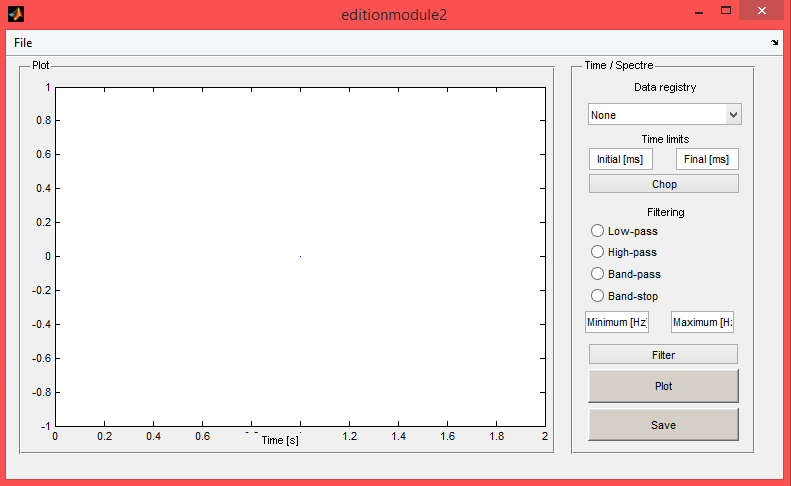
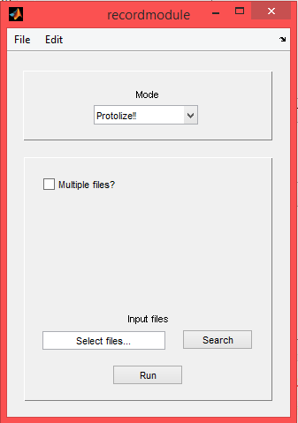

PROTOLIZE! 2
============

O PROTOLIZE! é uma ferramenta escrita em MATLAB para processamento de sinais de caráter biológico. Inicialmente [feito](http://repositorio.unb.br/bitstream/10482/4213/1/2009_SergioAndresCondeOcazionez.pdf) pelo professor [Sergio Ocazionez](http://lattes.cnpq.br/7159531395590165), que hoje se encontra no [Instituto do Cérebro da Universidade Federal do Rio Grande do Norte](http://www.neuro.ufrn.br/incerebro/), durante sua tese de mestrado na Universidade de Brasília, ele está sendo trabalhado no Laboratório de Neurociências e Comportamento da Universidade de Brasília.

O Protolize! está sendo escrito em MATLAB 2010 com auxílio do editor de textos [Atom](https://atom.io/). Esta documentação está sendo escrita em [Markdown](https://daringfireball.net/projects/markdown/) e sendo traduzido em HTML usando o script [markdown.lua](https://github.com/mpeterv/markdown) feito por [@mpeterv](https://github.com/mpeterv).

Pré-requisitos
--------------

Protolize! requer MATLAB 2010 rodando em um computador rodando Microsoft Windows 7 ou posterior com no mínimo 1GB RAM.

Instalação
----------

Para fazer o download do Protolize!, baixe o arquivo `P2.zip` e extraia seu conteudo em um pasta específica. Inicie o MATLAB e vá à pasta onde você extraiu a sua versão do Protolize!. Dentro desta pasta, entre o comando `protolize2`. Se não houver nenhum problema, o menu principal do Protolize! aparecerá, indicando que ele está pronto para uso.

Outras informações relevantes
-----------------------------

Os sinais a serem processados deverão estar no formato `*.ASCII`.

Menu principal
==============

O menu principal contém 3 divisões: [`Protocols`](#protocols), [`Edition`](#edition) e [`Analysis`](#analysis). A partir delas, podemos acessar as diversas funcionalidades do Protolize! como descritas em suas respectivas sessões.

Além disso, há uma [barra de ferramentas](#toolbar) para acesso rápido de diversos ajustes do programa, do módulo de estudos e do arquivo de ajuda.

Barra de ferramentas
--------------------

No topo da janela principal, temos uma barra de ferramentas com as opções `File`, `Settings` e `Help`.

Em `File`, pode-se sair do programa ou do módulo; ou abrir ou salvar arquivos de acordo com o módulo que está sendo usado.

Em `Settings`, pode-se alterar diversos valores usados na análise de sinais, em especial a taxa de amostragem (chamada de `fs`); e os ritmos mentais usados no estudo em questão. O software define, por padrão, os seguinte ritmos mentais:

+ Delta: 0.5 a 3.5Hz
+ Theta: 3.5 a 7Hz
+ Alpha: 8 a 13Hz
+ Beta: 15 a 24Hz
+ Gamma: 30 a 70Hz

Também pode-se ajustar o caminho em disco para o EEGLAB, caso disponível no computador do usuário, para que ambos possam atuar no processamento de sinais. Estes valores podem ser ajustados de acordo com a necessidade do usuário, e todos os parâmetros disponíveis para ajuste ficam guardados em memória para uso futuro.

Em `Studies`, pode-se acessar o [módulo de estudos](#studies); que permite processar arquivos em lote.

Em `Help`, tem-se acesso a este arquivo de ajuda que você está lendo.

Protocolos
==========

Por enquanto, temos 2 protocolos disponíveis: o TSST e o REFLEX.

<a name="edition"/>

Módulos de edição
=================

Para podermos visualizar e editar o sinal, há as ferramentas `Time/Spec` e `DWT`.

Time / Spectre
--------------

Este módulo fornece algumas ferramentas para edição de sinais no domínio do tempo. Em sua interface, pode-se notar que há ferramentas para cortar e para filtrar o sinal.

Inicialmente, carrega-se um sinal usando a opção `Open` no menu `File` da barra de ferramentas. Este sinal aparecerá na lista `Data registry`, no canto superior direito. Para mostrar este sinal na tela, aperte o botão `Plot`. Para cortar o sinal, digite os valores mínimo e máximo nas caixas `Min` e `Max`, respectivamente, e aperte o botão `Crop`. Para filtrar o sinal, existem 4 opções de filtros: passa-baixa, passa-alta, passa-banda ou rejeita-banda. Escolha o filtro e os intervalos de frequência desejados.

Para executar este módulo em separado, execute a função `editionmodule2`.

Discrete Wavelets Transform (DWT)
---------------------------------

O módulo DWT permite descontruir um sinal usando diversas transformadas de wavelets; fazer edições em seus coeficientes (isto é, em suas aproximações e detalhes); e reconstruir o sinal editado.

Este módulo permite que apenas um sinal seja trabalhado por vez. Para carregar um sinal na memória, abre o submenu `File` e selecione `Open` para escolher o arquivo com o sinal desejado. No canto superior esquerdo, há um painel com as opções de transformada de Wavelets: família de wavelets, tipo de wavelet e nível desejado. O botão `Calculate` determinará os coeficientes do sinal em memória.

Após a aplicação da transformada, pode-se escolher visualizar as aproximações ou os detalhes do sinal escolhido. Para editá-los, estão disponíveis as ferramentas no painel no lado direito. Nominalmente, pode-se substituir um coeficiente por um valor contínuo; e limitar os valores do coeficiente dentro de um intervalo.

Com os coeficientes editados, pode-se reconstruir o sinal clicando no botão `Reconstruct`. Para salvar o novo sinal, aperte o botão `Save`.

Para usar este módulo em separado, use o comando `dwtmodule2`. As funções relacionadas à transformada discreta de Wavelets estão disponíveis na pasta `math`; enquanto que as funções de edição dos coeficientes (que, por sinal, podem ser usadas para qualquer sinal) estão na pasta `util`.

Módulos de análise
==================

O Protolize! possui 4 ferramentas de análise de dados: análise no domínio do tempo (`Time domain`); análise por transformada de Fourier (`Fourier`); por transforma de Fourier de curta duração (`STFT`); e por transformada contínua de Wavelets (`CWT`).

Time Domain
-----------

A análise em domínio do tempo gera uma análise estatística do sinal em um período de tempo determinado. Selecione um sinal usando a opção `Open` no menu `File`. Este sinal pode ser cortado em um intervalo menor usando a opção `Crop`.

Para gerar uma análise deste sinal, aperte o botão `Generate Statistics`. A análise produzida poderá ser vista no painel ao lado direito, e poderá ser salva apertando o botão `Export statistics`.

Este módulo pode ser executado em separado usando o script `timemodule2`.

Fourier analysis
----------------

`TODO: ESCREVER DOCUMENTAÇÃO`

Short Time Fourier Transform (STFT)
-----------------------------------

`TODO: ESCREVER DOCUMENTAÇÃO`

Continuous Wavelet Transform (CWT)
----------------------------------

`O módulo ainda está em construção`

Módulo de Estudos
=================

O Protolize! contém um módulo para análise de vários arquivos em lote, chamado de _Studies module_. A entrada deste módulo é um arquivo CSV, sobre o qual eu tenho que escrever ainda.

Para rodar este módulo em separado, use o comando `recordmodule`.

Modo Protolize!
---------------

O modo Protolize! permite converter arquivos no formato EDF+ para o formato ASCII, separando o canal de anotações para um texto em separado.

Modo EEGLAB
-----------

O modo EEGLAB usa funções do próprio EEGLAB no Protolize para realizar ações comums no processamento digital de sinais. Nele, o usuário pode escolher quais ações tomar naquele processamento, sendo elas:

+ Cortar o sinal em um intervalo definido no arquivo de entrada;
+ Rerreferenciar os canais;
+ Reamostrar os sinais para uma taxa fornecida pelo usuário;
+ Rodar detecção de ICA em cada sinal.

